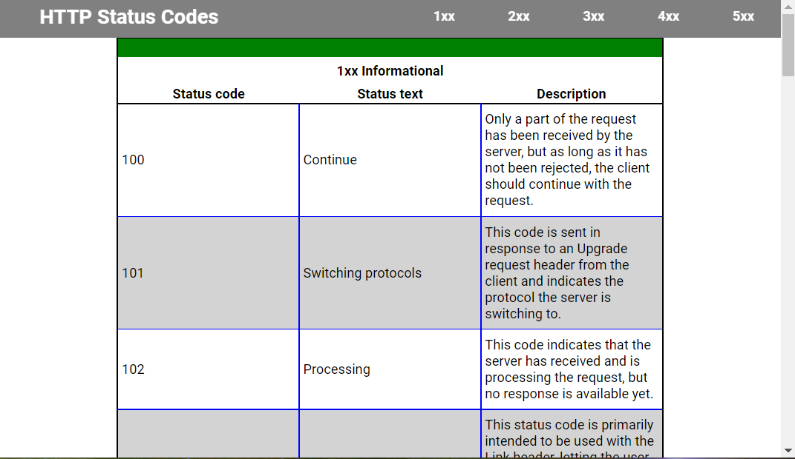
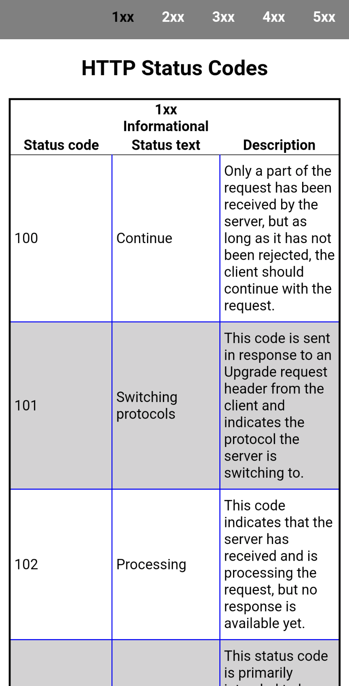
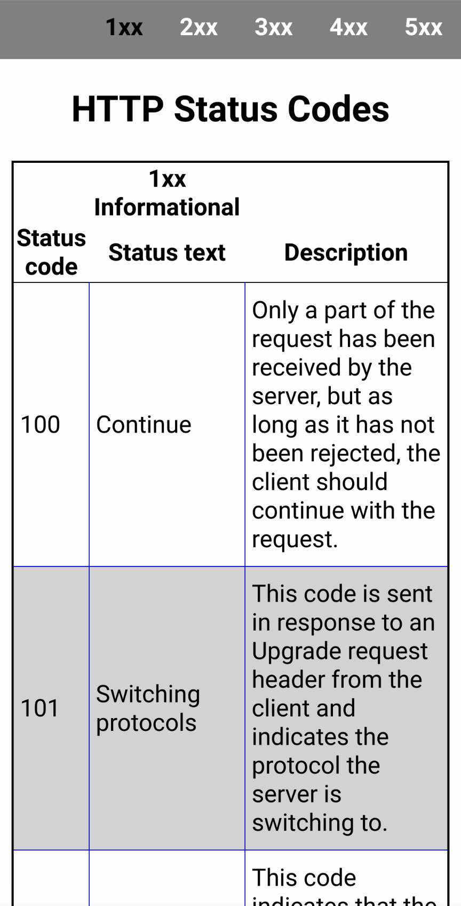

# HTTP Status Codes Reference

I found myself keeping a browser tab open to a page containing the status codes. The one I **was** using had a decent layout and was it was easy to find the code I needed. But then *someone* took it over and over-complicated the layout so a quick lookup wasn't going to happen any more.

I searched and looked at a lot of sites with a list. But every one of them was full of other information that made the pages cluttered. 

So I created this simple table of HTTP codes. I use it for reference, and the information it contains has been gathered from several sources. 

What has been imported here seemed to make sense (at the time) and provided useful information.

A number of codes are not present but can be added in the future. There are a bunch that are commented out at the end of the `httpcodes.html` file that are ready to use.

## Demonstration

The page can be viewed [here](<https://webexperiment.info/portfolio/hscref/>).

  

## Features

* Written HTML and CSS only
* Responsive
* Navigation Menu

## EXCEPTION

Android Firefox is a **lousy** browser. It does **not** render CSS correctly, and compared to other browsers on Android (Chrome, Edge, Opera) it just doesn't work right.

    <figure>
        
        
         <figcaption><strong>Chrome is on the left, Firefox on the right.</strong></figcaption>
    </figure>

 

So if your going to use Android Firefox to view this HTML page, don't. Get a different browser. You will be much happier!

## Sources of Information

The following were used to gather code descriptions. Some descriptions were paraphrased and/or shortened to fit the content.

* https://developer.mozilla.org/en-US/docs/Web/HTTP/Status
* https://www.iana.org/assignments/http-status-codes/http-status-codes.xhtml
* https://www.tutorialspoint.com/http/http_status_codes.htm

---

